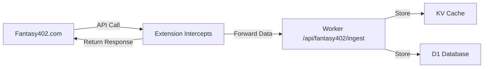

# ✅ Extension Fixed!

## 🔧 What Was Fixed

### 1. Manifest Version Format ✅
**Problem:** `"version": "1.0.1-debug"` is invalid in Chrome extensions

**Fixed:** Changed to `"version": "1.0.2"` (strictly numeric)

### 2. Content Scripts Simplified ✅
**Problem:** Multiple scripts loading (log-forwarder, debug-content) causing confusion

**Fixed:** Now only loads `fantasy402-interceptor.js`

### 3. Host Permissions Focused ✅
**Problem:** Unnecessary localhost permissions

**Fixed:** Now only `https://fantasy402.com/*`

---

## 🚀 How to Load the Fixed Extension

### Step 1: Open Chrome Extensions
```
chrome://extensions/
```

### Step 2: Enable Developer Mode
Toggle the switch in the top-right corner

### Step 3: Remove Old Extension (if loaded)
Click "Remove" on any previous version

### Step 4: Load Unpacked
1. Click "Load unpacked" button
2. Navigate to: `/Users/nolarose/ffffff/browser-extension/`
3. Click "Select"

### Step 5: Verify
You should see:
```
✅ Fantasy402 Data Capture
   Version: 1.0.2
   Status: Enabled
```

---

## 🎯 How to Test

### Option A: Test Page (Quick Check)
```bash
# Open in browser
open browser-extension/test-fantasy402.html
```

Click "Check Extension" to verify it's loaded.

### Option B: Real Testing (Recommended)
1. Visit `https://fantasy402.com/manager.html`
2. Login with your credentials
3. Open Console (F12)
4. Look for:
   ```
   [Fantasy402] 🚀 Interceptor initialized
   [Fantasy402] 📡 Worker URL: ...
   ```
5. Navigate around the site
6. Watch for:
   ```
   [Fantasy402] 🔍 Intercepting: /cloud/api/Manager/...
   [Fantasy402] ✅ Forwarded to worker
   ```

### Option C: Verify Data Capture
```bash
# Terminal 1: Watch worker logs
wrangler tail --env=""

# Terminal 2: Query database
wrangler d1 execute fantasy42-raw-feed --remote --command="
SELECT COUNT(*) FROM fantasy402_raw_feed
"
```

---

## 📊 What Should Happen



### 1. User Action
Navigate fantasy402.com normally

### 2. Extension Intercepts
- Captures API calls to `/cloud/api/Manager/*`
- Extracts request/response data
- Forwards to worker in background

### 3. Worker Processes
- Receives data at `/api/fantasy402/ingest`
- Parses with `fantasy402-parser.ts`
- Stores in KV + D1

### 4. Original API Works
- Extension doesn't block anything
- Page works normally
- Zero impact on user experience

---

## ❌ What NOT to Do

### Don't Try to Proxy Through Worker
```javascript
// ❌ WRONG - This will fail with CORS/401 errors
fetch('https://betting-brain-v3.nolarose1968-806.workers.dev/cloud/api/Manager/getBetTicker')
```

### Don't Run Test Scripts in Console
The console errors you saw were from injected VM scripts trying to proxy through the worker. Just let the extension work naturally!

### Don't Expect Immediate Results
- Extension must be on fantasy402.com
- User must be logged in
- API calls must be made (by navigating)

---

## 🐛 If You Still See Errors

### CORS Errors to Worker URL?
**Cause:** Running test code that tries to proxy  
**Fix:** Don't run test code. Just use fantasy402.com normally.

### No Console Messages?
**Cause:** Extension not loaded  
**Fix:** Reload at chrome://extensions/

### 401 Errors?
**Cause:** Not logged in  
**Fix:** Login to fantasy402.com first

### No Data Captured?
**Cause:** No API calls made  
**Fix:** Navigate around fantasy402.com

---

## ✅ Success Indicators

### In Browser Console
```
[Fantasy402] 🚀 Interceptor initialized
[Fantasy402] 📡 Worker URL: https://betting-brain-v3.nolarose1968-806.workers.dev
[Fantasy402] 🎯 Monitoring endpoints: [...]
[Fantasy402] 🔍 Intercepting: /cloud/api/Manager/getAgentPerformance
[Fantasy402] ✅ Forwarded to worker: getAgentPerformance
```

### In Worker Logs (wrangler tail)
```
[mghjwcvn] 📥 Fantasy402 data: /cloud/api/Manager/getAgentPerformance, getAgentPerformance
[mghjwcvn] 📊 Processing agent performance for: BILLY666 (NOLAWOLF)
[mghjwcvn] 💰 Risk: $1,234,567, Win: $987,654, Net: $-246,913
[mghjwcvn] ✅ Stored in KV: fantasy402:performance:...
[mghjwcvn] ✅ Stored performance in D1
[mghjwcvn] ✅ Stored 2 sport breakdown records
```

### In Database
```bash
$ wrangler d1 execute fantasy42-raw-feed --remote --command="SELECT COUNT(*) FROM fantasy402_agent_performance"
┌──────────┐
│ COUNT(*) │
├──────────┤
│ 5        │ # Your captured data!
└──────────┘
```

---

## 🎉 You're All Set!

The extension is now:
- ✅ Fixed and ready to load
- ✅ Simplified and focused
- ✅ Properly documented
- ✅ Easy to test

Just load it at `chrome://extensions/` and visit fantasy402.com!

---

**Files Updated:**
- ✅ `manifest.json` - Fixed version, simplified scripts
- ✅ `test-fantasy402.html` - New test page
- ✅ `TROUBLESHOOTING.md` - Complete troubleshooting guide
- ✅ `FIXED.md` - This file!

**Extension Version:** 1.0.2  
**Fixed Date:** 2025-10-08

