# 🏗️ Betting-Brain v3 Architecture Diagrams

## System Overview

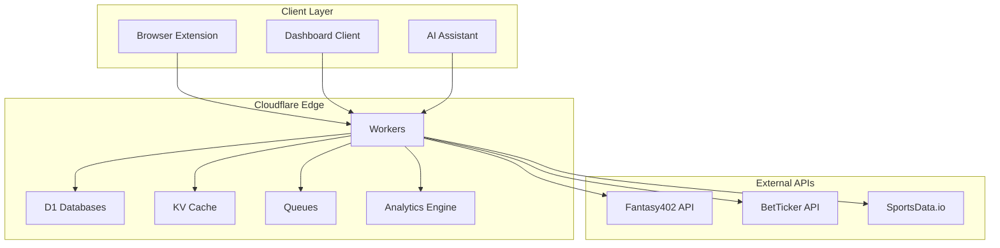

## 🎨 ASCII ANSI Color Architecture

```
┌─────────────────────────────────────────────────────────────────────────────────────────┐
│ 🌐 CLOUDFLARE EDGE NETWORK (Account: nolarose1968-806)                                  │
├─────────────────────────────────────────────────────────────────────────────────────────┤
│                                                                                         │
│  ┌─────────────────┐    ┌─────────────────┐    ┌─────────────────┐                 │
│  │ 🔵 WORKERS       │    │ 🟢 D1 DATABASES  │    │ 🟡 KV CACHE     │                 │
│  │                  │    │                  │    │                  │                 │
│  │ betting-brain-v3 │    │ betting-analytics│    │ BET_TICKER_RAW  │                 │
│  │ -prod            │    │ fantasy42-raw   │    │ FANTASY_CACHE   │                 │
│  │ -staging         │    │                 │    │ RATE_LIMITER    │                 │
│  │                  │    │                 │    │ TOKEN_STORE     │                 │
│  │ CPU: 50ms limit  │    │ 32 tables       │    │ USER_STORE      │                 │
│  │ Memory: 128MB    │    │ 20 tables       │    │ SESSION_STORE   │                 │
│  │                  │    │                 │    │ REFRESH_STORE   │                 │
│  └─────────────────┘    └─────────────────┘    └─────────────────┘                 │
│           │                       │                       │                          │
│           └───────────────────────┼───────────────────────┘                          │
│                                   │                                                   │
│  ┌─────────────────┐    ┌─────────────────┐    ┌─────────────────┐                 │
│  │ 🔴 QUEUES        │    │ 🟣 ANALYTICS     │    │ 🟠 EXTERNAL     │                 │
│  │                  │    │                  │    │                  │                 │
│  │ line-ingress     │    │ Analytics Engine │    │ Fantasy402 API  │                 │
│  │ steam-webhook    │    │ betting-metrics  │    │ BetTicker API   │                 │
│  │ steam-processor  │    │ 7-day retention │    │ SportsData.io   │                 │
│  │ exposure-calc    │    │                  │    │                  │                 │
│  │ fantasy402-logs  │    │                  │    │                  │                 │
│  │                  │    │                  │    │                  │                 │
│  └─────────────────┘    └─────────────────┘    └─────────────────┘                 │
│                                                                                         │
└─────────────────────────────────────────────────────────────────────────────────────────┘
```

## 🌐 Network Architecture

```mermaid
graph TB
    subgraph "Internet"
        EXT[External Clients]
        API[External APIs]
    end
    
    subgraph "Cloudflare Edge Network"
        subgraph "Account: nolarose1968-806"
            subgraph "Workers"
                W1[betting-brain-v3-prod<br/>🌐 prod.nolarose1968-806.workers.dev]
                W2[betting-brain-v3-staging<br/>🌐 staging.nolarose1968-806.workers.dev]
            end
            
            subgraph "D1 Databases"
                D1A[betting-analytics<br/>📊 32 tables]
                D1B[fantasy42-raw-feed<br/>📊 20 tables]
            end
            
            subgraph "KV Namespaces"
                KV1[BET_TICKER_RAW<br/>🗄️ 7-day retention]
                KV2[FANTASY_CACHE<br/>🗄️ Config cache]
                KV3[RATE_LIMITER<br/>🗄️ Rate limiting]
                KV4[TOKEN_STORE<br/>🗄️ JWT tokens]
                KV5[USER_STORE<br/>🗄️ User data]
                KV6[SESSION_STORE<br/>🗄️ Sessions]
                KV7[REFRESH_STORE<br/>🗄️ Refresh tokens]
                KV8[LIVEBETS_STORE<br/>🗄️ Live betting]
            end
            
            subgraph "Queues"
                Q1[line-ingress<br/>📨 Line movements]
                Q2[steam-webhook<br/>📨 Steam alerts]
                Q3[steam-processor<br/>📨 Steam processing]
                Q4[exposure-calculator<br/>📨 Risk calc]
                Q5[fantasy402-logs<br/>📨 Fantasy402 data]
            end
            
            subgraph "Analytics Engine"
                AE1[betting-metrics<br/>📈 Time-series data]
            end
        end
    end
    
    subgraph "External Services"
        F402[Fantasy402 API<br/>🎲 fantasy402.com]
        BT[BetTicker API<br/>📊 BetTicker service]
        SD[SportsData.io<br/>⚽ Sports data]
    end
    
    EXT --> W1
    EXT --> W2
    W1 --> D1A
    W1 --> D1B
    W1 --> KV1
    W1 --> KV2
    W1 --> KV3
    W1 --> KV4
    W1 --> KV5
    W1 --> KV6
    W1 --> KV7
    W1 --> KV8
    W1 --> Q1
    W1 --> Q2
    W1 --> Q3
    W1 --> Q4
    W1 --> Q5
    W1 --> AE1
    
    W1 --> F402
    W1 --> BT
    W1 --> SD
```

## 🔄 Data Flow Architecture

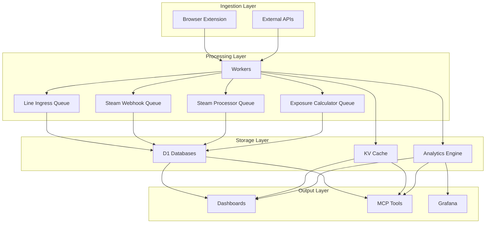

## 🔧 Cloudflare Bindings & Variables

```
┌─────────────────────────────────────────────────────────────────────────────────────────┐
│ 🔧 CLOUDFLARE WORKER BINDINGS (Account: nolarose1968-806)                              │
├─────────────────────────────────────────────────────────────────────────────────────────┤
│                                                                                         │
│ 📊 D1 DATABASE BINDINGS:                                                                │
│ ┌─────────────────────────────────────────────────────────────────────────────────────┐ │
│ │ ANALYTICS            → betting-analytics (1fd6d6d3-7b0f-4488-a651-a234c61705b1)   │ │
│ │ RAW_FEED_DB          → fantasy42-raw-feed (1b2e8ea8-a702-4cc7-9665-a8bea78b5dea) │ │
│ └─────────────────────────────────────────────────────────────────────────────────────┘ │
│                                                                                         │
│ 🗄️ KV NAMESPACE BINDINGS:                                                               │
│ ┌─────────────────────────────────────────────────────────────────────────────────────┐ │
│ │ BET_TICKER_RAW       → 8b9618cb00c647f18ad83458e0061018 (7-day retention)         │ │
│ │ FANTASY_CACHE        → [namespace-id] (Config cache)                               │ │
│ │ RATE_LIMITER         → [namespace-id] (Rate limiting)                              │ │
│ │ TOKEN_STORE          → [namespace-id] (JWT tokens)                                 │ │
│ │ USER_STORE           → [namespace-id] (User data)                                  │ │
│ │ SESSION_STORE        → [namespace-id] (Sessions)                                   │ │
│ │ REFRESH_STORE        → [namespace-id] (Refresh tokens)                            │ │
│ │ LIVEBETS_STORE       → [namespace-id] (Live betting)                              │ │
│ └─────────────────────────────────────────────────────────────────────────────────────┘ │
│                                                                                         │
│ 📨 QUEUE BINDINGS:                                                                      │
│ ┌─────────────────────────────────────────────────────────────────────────────────────┐ │
│ │ LINE_INGRESS         → line-ingress-prod (10 msg/batch, 5s timeout)               │ │
│ │ STEAM_WEBHOOK        → steam-webhook-prod (5 msg/batch, 10s timeout)              │ │
│ │ STEAM_QUEUE          → steam-processor-prod (10 msg/batch, 2s timeout, 2 retries) │ │
│ │ EXPOSURE_QUEUE       → exposure-calculator-prod (50 msg/batch, 10s timeout, 3 retries) │ │
│ │ FANTASY402_QUEUE     → fantasy402-logs-prod (100 msg/batch, 5s timeout, 5 retries) │ │
│ └─────────────────────────────────────────────────────────────────────────────────────┘ │
│                                                                                         │
│ 📈 ANALYTICS ENGINE BINDINGS:                                                           │
│ ┌─────────────────────────────────────────────────────────────────────────────────────┐ │
│ │ ANALYTICS_ENGINE     → betting-metrics-prod (7-day retention)                      │ │
│ └─────────────────────────────────────────────────────────────────────────────────────┘ │
│                                                                                         │
│ 🌐 ENVIRONMENT VARIABLES:                                                               │
│ ┌─────────────────────────────────────────────────────────────────────────────────────┐ │
│ │ JWT_SECRET           → [32-char secret] (JWT signing)                              │ │
│ │ PINNACLE_KEY_1       → [API key] (Pinnacle odds)                                   │ │
│ │ PINNACLE_KEY_2       → [API key] (Pinnacle odds)                                   │ │
│ │ PINNACLE_KEY_3       → [API key] (Pinnacle odds)                                   │ │
│ │ BET365_KEY           → [API key] (Bet365 odds)                                     │ │
│ │ SPORTSDATA_KEY       → [API key] (SportsData.io)                                   │ │
│ │ FANTASY402_SECRET    → [secret] (Fantasy402 auth)                                  │ │
│ │ EXTENSION_SECRET     → default-dev-secret-change-me (Extension auth)               │ │
│ └─────────────────────────────────────────────────────────────────────────────────────┘ │
│                                                                                         │
└─────────────────────────────────────────────────────────────────────────────────────────┘
```

## 🌐 Network Topology

```
┌─────────────────────────────────────────────────────────────────────────────────────────┐
│ 🌐 CLOUDFLARE EDGE NETWORK TOPOLOGY                                                    │
├─────────────────────────────────────────────────────────────────────────────────────────┤
│                                                                                         │
│  Internet                                                                               │
│     │                                                                                   │
│     ▼                                                                                   │
│ ┌─────────────────────────────────────────────────────────────────────────────────────┐ │
│ │ 🔵 CLOUDFLARE EDGE (200+ locations worldwide)                                       │ │
│ │                                                                                     │ │
│ │ ┌─────────────────┐    ┌─────────────────┐    ┌─────────────────┐                 │ │
│ │ │ 🌍 US East      │    │ 🌍 Europe       │    │ 🌍 Asia Pacific  │                 │ │
│ │ │                 │    │                 │    │                 │                 │ │
│ │ │ Virginia        │    │ Amsterdam       │    │ Tokyo           │                 │ │
│ │ │ New York        │    │ Frankfurt       │    │ Singapore       │                 │ │
│ │ │ Miami           │    │ London          │    │ Sydney          │                 │ │
│ │ │                 │    │                 │    │                 │                 │ │
│ │ └─────────────────┘    └─────────────────┘    └─────────────────┘                 │ │
│ │           │                       │                       │                      │ │
│ │           └───────────────────────┼───────────────────────┘                      │ │
│ │                                   │                                               │ │
│ │ ┌─────────────────────────────────────────────────────────────────────────────────┐ │ │
│ │ │ 🏢 ACCOUNT: nolarose1968-806                                                   │ │ │
│ │ │                                                                                 │ │ │
│ │ │ ┌─────────────────┐    ┌─────────────────┐    ┌─────────────────┐             │ │ │
│ │ │ │ 🔵 WORKERS       │    │ 🟢 D1 DATABASES  │    │ 🟡 KV CACHE     │             │ │ │
│ │ │ │                  │    │                  │    │                  │             │ │ │
│ │ │ │ betting-brain-v3 │    │ betting-analytics│    │ BET_TICKER_RAW  │             │ │ │
│ │ │ │ -prod            │    │ fantasy42-raw   │    │ FANTASY_CACHE   │             │ │ │
│ │ │ │ -staging         │    │                 │    │ RATE_LIMITER    │             │ │ │
│ │ │ │                  │    │                 │    │ TOKEN_STORE     │             │ │ │
│ │ │ │ CPU: 50ms limit  │    │ 32 tables       │    │ USER_STORE      │             │ │ │
│ │ │ │ Memory: 128MB    │    │ 20 tables       │    │ SESSION_STORE   │             │ │ │
│ │ │ │                  │    │                 │    │ REFRESH_STORE   │             │ │ │
│ │ │ └─────────────────┘    └─────────────────┘    └─────────────────┘             │ │ │
│ │ │           │                       │                       │                  │ │ │
│ │ │           └───────────────────────┼───────────────────────┘                  │ │ │
│ │ │                                   │                                           │ │ │
│ │ │ ┌─────────────────┐    ┌─────────────────┐    ┌─────────────────┐             │ │ │
│ │ │ │ 🔴 QUEUES        │    │ 🟣 ANALYTICS     │    │ 🟠 EXTERNAL     │             │ │ │
│ │ │ │                  │    │                  │    │                  │             │ │ │
│ │ │ │ line-ingress     │    │ Analytics Engine │    │ Fantasy402 API  │             │ │ │
│ │ │ │ steam-webhook    │    │ betting-metrics  │    │ BetTicker API   │             │ │ │
│ │ │ │ steam-processor  │    │ 7-day retention │    │ SportsData.io   │             │ │ │
│ │ │ │ exposure-calc    │    │                  │    │                  │             │ │ │
│ │ │ │ fantasy402-logs  │    │                  │    │                  │             │ │ │
│ │ │ │                  │    │                  │    │                  │             │ │ │
│ │ │ └─────────────────┘    └─────────────────┘    └─────────────────┘             │ │ │
│ │ └─────────────────────────────────────────────────────────────────────────────────┘ │ │
│ └─────────────────────────────────────────────────────────────────────────────────────┘ │
│                                                                                         │
└─────────────────────────────────────────────────────────────────────────────────────────┘
```

## 🚀 Deployment Pipeline

```
┌─────────────────────────────────────────────────────────────────────────────────────────┐
│ 🚀 CLOUDFLARE DEPLOYMENT PIPELINE (Account: nolarose1968-806)                         │
├─────────────────────────────────────────────────────────────────────────────────────────┤
│                                                                                         │
│  Local Development                                                                      │
│     │                                                                                   │
│     ▼                                                                                   │
│ ┌─────────────────────────────────────────────────────────────────────────────────────┐ │
│ │ 🔧 WRANGLER DEV                                                                     │ │
│ │                                                                                     │ │
│ │ wrangler dev --local                                                                │ │
│ │ ├── Local D1 databases                                                              │ │
│ │ ├── Local KV storage                                                                │ │
│ │ ├── Local queue processing                                                          │ │
│ │ └── Hot reload enabled                                                              │ │
│ └─────────────────────────────────────────────────────────────────────────────────────┘ │
│     │                                                                                   │
│     ▼                                                                                   │
│ ┌─────────────────────────────────────────────────────────────────────────────────────┐ │
│ │ 🧪 TESTING & VALIDATION                                                             │ │
│ │                                                                                     │ │
│ │ bun run floor:health                                                                │ │
│ │ ├── Lint check (0 errors)                                                           │ │
│ │ ├── Type check (154 known issues, non-blocking)                                    │ │
│ │ ├── Test suite (441/584, 75.5% pass rate)                                         │ │
│ │ ├── Coverage (81%, target: 81%)                                                    │ │
│ │ └── Security audit (99 hints, 0 errors)                                            │ │
│ └─────────────────────────────────────────────────────────────────────────────────────┘ │
│     │                                                                                   │
│     ▼                                                                                   │
│ ┌─────────────────────────────────────────────────────────────────────────────────────┐ │
│ │ 📦 BUILD & PACKAGE                                                                   │ │
│ │                                                                                     │ │
│ │ bun run build                                                                       │ │
│ │ ├── TypeScript compilation                                                          │ │
│ │ ├── Asset bundling                                                                  │ │
│ │ ├── Dependency optimization                                                         │ │
│ │ └── Source map generation                                                           │ │
│ └─────────────────────────────────────────────────────────────────────────────────────┘ │
│     │                                                                                   │
│     ▼                                                                                   │
│ ┌─────────────────────────────────────────────────────────────────────────────────────┐ │
│ │ 🌐 CLOUDFLARE DEPLOYMENT                                                            │ │
│ │                                                                                     │ │
│ │ wrangler deploy --env production                                                    │ │
│ │ ├── Worker deployment (betting-brain-v3-prod)                                       │ │
│ │ ├── D1 migrations (betting-analytics, fantasy42-raw-feed)                          │ │
│ │ ├── KV namespace sync                                                               │ │
│ │ ├── Queue configuration                                                             │ │
│ │ ├── Analytics Engine setup                                                         │ │
│ │ └── Environment variables                                                           │ │
│ └─────────────────────────────────────────────────────────────────────────────────────┘ │
│     │                                                                                   │
│     ▼                                                                                   │
│ ┌─────────────────────────────────────────────────────────────────────────────────────┐ │
│ │ ✅ PRODUCTION VERIFICATION                                                          │ │
│ │                                                                                     │ │
│ │ Health Check: https://betting-brain-v3-prod.nolarose1968-806.workers.dev/health   │ │
│ │ ├── Worker status: ✅ UP                                                            │ │
│ │ ├── Database connectivity: ✅ UP                                                   │ │
│ │ ├── KV access: ✅ UP                                                               │ │
│ │ ├── Queue processing: ✅ UP                                                        │ │
│ │ ├── Analytics Engine: ✅ UP                                                        │ │
│ │ └── External API connectivity: ✅ UP                                               │ │
│ └─────────────────────────────────────────────────────────────────────────────────────┘ │
│                                                                                         │
└─────────────────────────────────────────────────────────────────────────────────────────┘
```

## 🔄 Cache Architecture

```
┌─────────────────────────────────────────────────────────────────────────────────────────┐
│ 🔄 KV CACHE ARCHITECTURE (Account: nolarose1968-806)                                  │
├─────────────────────────────────────────────────────────────────────────────────────────┤
│                                                                                         │
│ ┌─────────────────────────────────────────────────────────────────────────────────────┐ │
│ │ 🗄️ KV NAMESPACES OVERVIEW                                                           │ │
│ │                                                                                     │ │
│ │ ┌─────────────────┐    ┌─────────────────┐    ┌─────────────────┐                 │ │
│ │ │ BET_TICKER_RAW  │    │ FANTASY_CACHE   │    │ RATE_LIMITER    │                 │ │
│ │ │                 │    │                 │    │                 │                 │ │
│ │ │ Purpose:        │    │ Purpose:        │    │ Purpose:        │                 │ │
│ │ │ Raw API responses│    │ Config cache    │    │ Rate limiting   │                 │ │
│ │ │                 │    │                 │    │                 │                 │ │
│ │ │ Retention: 7d   │    │ Retention: 24h  │    │ Retention: 1h   │                 │ │
│ │ │ Keys: ~1000     │    │ Keys: ~50       │    │ Keys: ~10000    │                 │ │
│ │ │ Size: ~10MB     │    │ Size: ~1MB      │    │ Size: ~5MB      │                 │ │
│ │ └─────────────────┘    └─────────────────┘    └─────────────────┘                 │ │
│ │                                                                                     │ │
│ │ ┌─────────────────┐    ┌─────────────────┐    ┌─────────────────┐                 │ │
│ │ │ TOKEN_STORE     │    │ USER_STORE      │    │ SESSION_STORE   │                 │ │
│ │ │                 │    │                 │    │                 │                 │ │
│ │ │ Purpose:        │    │ Purpose:        │    │ Purpose:        │                 │ │
│ │ │ JWT tokens      │    │ User data       │    │ Active sessions │                 │ │
│ │ │                 │    │                 │    │                 │                 │ │
│ │ │ Retention: 24h  │    │ Retention: 30d  │    │ Retention: 7d   │                 │ │
│ │ │ Keys: ~5000     │    │ Keys: ~1000     │    │ Keys: ~500      │                 │ │
│ │ │ Size: ~2MB      │    │ Size: ~5MB      │    │ Size: ~1MB      │                 │ │
│ │ └─────────────────┘    └─────────────────┘    └─────────────────┘                 │ │
│ │                                                                                     │ │
│ │ ┌─────────────────┐    ┌─────────────────┐                                         │ │
│ │ │ REFRESH_STORE   │    │ LIVEBETS_STORE  │                                         │ │
│ │ │                 │    │                 │                                         │ │
│ │ │ Purpose:        │    │ Purpose:        │                                         │ │
│ │ │ Refresh tokens  │    │ Live betting    │                                         │ │
│ │ │                 │    │                 │                                         │ │
│ │ │ Retention: 30d  │    │ Retention: 1h   │                                         │ │
│ │ │ Keys: ~2000     │    │ Keys: ~5000     │                                         │ │
│ │ │ Size: ~1MB      │    │ Size: ~10MB     │                                         │ │
│ │ └─────────────────┘    └─────────────────┘                                         │ │
│ └─────────────────────────────────────────────────────────────────────────────────────┘ │
│                                                                                         │
│ ┌─────────────────────────────────────────────────────────────────────────────────────┐ │
│ │ 🔄 CACHE FLOW DIAGRAM                                                               │ │
│ │                                                                                     │ │
│ │ Request → Worker → KV Check → Cache Hit/Miss → Response                             │ │
│ │     │        │         │            │                                               │ │
│ │     │        │         │            ▼                                               │ │
│ │     │        │         │    ┌─────────────────┐                                    │ │
│ │     │        │         │    │ Cache Hit        │                                    │ │
│ │     │        │         │    │ ├── Return data  │                                    │ │
│ │     │        │         │    │ ├── Update TTL   │                                    │ │
│ │     │        │         │    │ └── Log metrics  │                                    │ │
│ │     │        │         │    └─────────────────┘                                    │ │
│ │     │        │         │            │                                               │ │
│ │     │        │         │            ▼                                               │ │
│ │     │        │         │    ┌─────────────────┐                                    │ │
│ │     │        │         │    │ Cache Miss      │                                    │ │
│ │     │        │         │    │ ├── Query D1    │                                    │ │
│ │     │        │         │    │ ├── Store in KV │                                    │ │
│ │     │        │         │    │ ├── Return data │                                    │ │
│ │     │        │         │    │ └── Log metrics │                                    │ │
│ │     │        │         │    └─────────────────┘                                    │ │
│ └─────────────────────────────────────────────────────────────────────────────────────┘ │
│                                                                                         │
└─────────────────────────────────────────────────────────────────────────────────────────┘
```

## 🔗 Complete API Endpoints Reference

```
┌─────────────────────────────────────────────────────────────────────────────────────────┐
│ 🔗 COMPLETE API ENDPOINTS REFERENCE (Account: nolarose1968-806)                      │
├─────────────────────────────────────────────────────────────────────────────────────────┤
│                                                                                         │
│ ┌─────────────────────────────────────────────────────────────────────────────────────┐ │
│ │ 🌐 CORE SYSTEM ENDPOINTS (7 endpoints)                                             │ │
│ │                                                                                     │ │
│ │ GET  /health                                                                        │ │
│ │ ├── Purpose: Basic health check                                                     │ │
│ │ ├── Parameters: None                                                               │ │
│ │ ├── Response: { status, version, timestamp, requestId, duration }                   │ │
│ │ ├── Example: https://betting-brain-v3-prod.nolarose1968-806.workers.dev/health    │ │
│ │ └── Used by: All dashboards, monitoring tools, browser extension                   │ │
│ │                                                                                     │ │
│ │ GET  /floor/status                                                                  │ │
│ │ ├── Purpose: Detailed system status with Floor metrics                             │ │
│ │ ├── Parameters: None                                                               │ │
│ │ ├── Response: { version, status, health, tests, coverage, mcpTools, sportsApi }    │ │
│ │ ├── Example: https://betting-brain-v3-prod.nolarose1968-806.workers.dev/floor/status│ │
│ │ └── Used by: Floor Control dashboard, system monitoring                           │ │
│ │                                                                                     │ │
│ │ GET  /api/health/dns                                                                │ │
│ │ ├── Purpose: DNS health check                                                      │ │
│ │ ├── Parameters: None                                                               │ │
│ │ ├── Response: { dns: object, requestId: string }                                   │ │
│ │ ├── Example: https://betting-brain-v3-prod.nolarose1968-806.workers.dev/api/health/dns│ │
│ │ └── Used by: Network diagnostics, health monitoring                               │ │
│ │                                                                                     │ │
│ │ GET  /api/health/dns/batch                                                         │ │
│ │ ├── Purpose: Batch DNS health check                                                │ │
│ │ ├── Parameters: None                                                               │ │
│ │ ├── Response: { dns: Array, requestId: string }                                    │ │
│ │ ├── Example: https://betting-brain-v3-prod.nolarose1968-806.workers.dev/api/health/dns/batch│ │
│ │ └── Used by: Network diagnostics, batch health checks                             │ │
│ │                                                                                     │ │
│ │ GET  /diagnostics                                                                   │ │
│ │ ├── Purpose: System diagnostics                                                    │ │
│ │ ├── Parameters: None                                                               │ │
│ │ ├── Response: { bindings, kv, lastChecks, requestId }                              │ │
│ │ ├── Example: https://betting-brain-v3-prod.nolarose1968-806.workers.dev/diagnostics│ │
│ │ └── Used by: Setup wizard, health monitor                                          │ │
│ │                                                                                     │ │
│ │ GET  /system-status                                                                 │ │
│ │ ├── Purpose: Detailed system status                                                │ │
│ │ ├── Parameters: None                                                               │ │
│ │ ├── Response: { uptime, memory, kvRecords, healthIndicators }                      │ │
│ │ ├── Example: https://betting-brain-v3-prod.nolarose1968-806.workers.dev/system-status│ │
│ │ └── Used by: Dashboard stats                                                       │ │
│ │                                                                                     │ │
│ │ GET  /logs                                                                          │ │
│ │ ├── Purpose: System logs                                                            │ │
│ │ ├── Parameters: None                                                               │ │
│ │ ├── Response: { logs: Array, requestId: string }                                   │ │
│ │ ├── Example: https://betting-brain-v3-prod.nolarose1968-806.workers.dev/logs      │ │
│ │ └── Used by: Log analysis, debugging                                               │ │
│ └─────────────────────────────────────────────────────────────────────────────────────┘ │
│                                                                                         │
│ ┌─────────────────────────────────────────────────────────────────────────────────────┐ │
│ │ 🤖 MCP & INTELLIGENCE TOOLS (10 endpoints)                                        │ │
│ │                                                                                     │ │
│ │ POST /mcp                                                                           │ │
│ │ ├── Purpose: JSON-RPC 2.0 MCP server                                               │ │
│ │ ├── Parameters: { jsonrpc: "2.0", id: number, method: string, params: object }   │ │
│ │ ├── Methods: initialize, tools/list, tools/call                                   │ │
│ │ ├── Response: { jsonrpc: "2.0", id: number, result: object }                     │ │
│ │ ├── Example: https://betting-brain-v3-prod.nolarose1968-806.workers.dev/mcp      │ │
│ │ └── Used by: Claude Desktop, AI assistants, Dashboard Pro                        │ │
│ │                                                                                     │ │
│ │ GET  /api/events                                                                   │ │
│ │ ├── Purpose: Active events                                                         │ │
│ │ ├── Parameters: ?sport=nba&limit=20&includeHistory=false                          │ │
│ │ ├── Response: { events: Array, total: number, requestId: string }                 │ │
│ │ ├── Example: https://betting-brain-v3-prod.nolarose1968-806.workers.dev/api/events│ │
│ │ └── Used by: Event monitoring, sports data                                        │ │
│ │                                                                                     │ │
│ │ GET  /api/exposure                                                                 │ │
│ │ ├── Purpose: Betting exposure                                                      │ │
│ │ ├── Parameters: ?agentID=agent_123&eventID=nba_123&sport=nba&exposureLevel=high  │ │
│ │ ├── Response: { exposure: object, requestId: string }                             │ │
│ │ ├── Example: https://betting-brain-v3-prod.nolarose1968-806.workers.dev/api/exposure│ │
│ │ └── Used by: Risk management, exposure tracking                                   │ │
│ │                                                                                     │ │
│ │ GET  /api/sharp-customers                                                          │ │
│ │ ├── Purpose: Sharp customers                                                       │ │
│ │ ├── Parameters: ?limit=50&minCLV=0.05&includeHistory=true                         │ │
│ │ ├── Response: { customers: Array, total: number, requestId: string }              │ │
│ │ ├── Example: https://betting-brain-v3-prod.nolarose1968-806.workers.dev/api/sharp-customers│ │
│ │ └── Used by: Customer analytics, sharp identification                             │ │
│ │                                                                                     │ │
│ │ GET  /api/steam-moves                                                              │ │
│ │ ├── Purpose: Steam moves                                                           │ │
│ │ ├── Parameters: ?limit=100&sport=nba&timeRange=24h                                │ │
│ │ ├── Response: { moves: Array, total: number, requestId: string }                  │ │
│ │ ├── Example: https://betting-brain-v3-prod.nolarose1968-806.workers.dev/api/steam-moves│ │
│ │ └── Used by: Live betting, steam detection                                        │ │
│ │                                                                                     │ │
│ │ GET  /api/clv                                                                      │ │
│ │ ├── Purpose: Closing line value                                                    │ │
│ │ ├── Parameters: ?agentID=agent_123&timeRange=7d&includeHistory=true               │ │
│ │ ├── Response: { clv: object, requestId: string }                                  │ │
│ │ ├── Example: https://betting-brain-v3-prod.nolarose1968-806.workers.dev/api/clv  │ │
│ │ └── Used by: Customer analytics, CLV analysis                                     │ │
│ │                                                                                     │ │
│ │ GET  /api/hold                                                                     │ │
│ │ ├── Purpose: Hold percentage                                                       │ │
│ │ ├── Parameters: ?sport=nba&timeRange=30d&includeForecast=true                     │ │
│ │ ├── Response: { hold: object, requestId: string }                                 │ │
│ │ ├── Example: https://betting-brain-v3-prod.nolarose1968-806.workers.dev/api/hold  │ │
│ │ └── Used by: Financial analytics, hold tracking                                   │ │
│ │                                                                                     │ │
│ │ GET  /api/markets                                                                  │ │
│ │ ├── Purpose: Market data                                                           │ │
│ │ ├── Parameters: ?sport=nba&marketType=moneyline&includeHistory=true                │ │
│ │ ├── Response: { markets: Array, requestId: string }                               │ │
│ │ ├── Example: https://betting-brain-v3-prod.nolarose1968-806.workers.dev/api/markets│ │
│ │ └── Used by: Market analysis, odds tracking                                       │ │
│ │                                                                                     │ │
│ │ GET  /api/customers                                                                │ │
│ │ ├── Purpose: Customer data                                                         │ │
│ │ ├── Parameters: ?agentID=agent_123&limit=100&includeHistory=true                  │ │
│ │ ├── Response: { customers: Array, total: number, requestId: string }              │ │
│ │ ├── Example: https://betting-brain-v3-prod.nolarose1968-806.workers.dev/api/customers│ │
│ │ └── Used by: Customer management, analytics                                       │ │
│ │                                                                                     │ │
│ │ GET  /api/stats                                                                    │ │
│ │ ├── Purpose: System statistics                                                     │ │
│ │ ├── Parameters: ?timeRange=24h&includeBreakdown=true                              │ │
│ │ ├── Response: { stats: object, requestId: string }                                │ │
│ │ ├── Example: https://betting-brain-v3-prod.nolarose1968-806.workers.dev/api/stats │ │
│ │ └── Used by: System monitoring, analytics                                         │ │
│ └─────────────────────────────────────────────────────────────────────────────────────┘ │
│                                                                                         │
│ ┌─────────────────────────────────────────────────────────────────────────────────────┐ │
│ │ 🏈 SPORTS & LIVE DATA (6 endpoints)                                                │ │
│ │                                                                                     │ │
│ │ GET  /api/live-odds                                                                │ │
│ │ ├── Purpose: Live odds aggregation                                                  │ │
│ │ ├── Parameters: ?sport=nba&market=moneyline                                        │ │
│ │ ├── Response: { sport, market, sources: Array, aggregatedAt, cacheHit }            │ │
│ │ ├── Example: https://betting-brain-v3-prod.nolarose1968-806.workers.dev/api/live-odds│ │
│ │ └── Used by: Live odds dashboard, sports betting                                   │ │
│ │                                                                                     │ │
│ │ GET  /api/live-scores                                                              │ │
│ │ ├── Purpose: Live scores                                                           │ │
│ │ ├── Parameters: ?sport=nba&includeHistory=true                                     │ │
│ │ ├── Response: { scores: Array, requestId: string }                                 │ │
│ │ ├── Example: https://betting-brain-v3-prod.nolarose1968-806.workers.dev/api/live-scores│ │
│ │ └── Used by: Live scores dashboard, sports data                                    │ │
│ │                                                                                     │ │
│ │ GET  /api/sports/live                                                              │ │
│ │ ├── Purpose: Live sports data                                                      │ │
│ │ ├── Parameters: ?sport=nba&includeAnalytics=true                                   │ │
│ │ ├── Response: { sports: Array, requestId: string }                                 │ │
│ │ ├── Example: https://betting-brain-v3-prod.nolarose1968-806.workers.dev/api/sports/live│ │
│ │ └── Used by: Live sports dashboard, real-time data                                │ │
│ │                                                                                     │ │
│ │ GET  /api/analytics/live                                                           │ │
│ │ ├── Purpose: Live analytics                                                        │ │
│ │ ├── Parameters: ?timeRange=1h&includeAlerts=true                                  │ │
│ │ ├── Response: { analytics: object, requestId: string }                             │ │
│ │ ├── Example: https://betting-brain-v3-prod.nolarose1968-806.workers.dev/api/analytics/live│ │
│ │ └── Used by: Live analytics dashboard, real-time monitoring                       │ │
│ │                                                                                     │ │
│ │ GET  /api/sessions/live                                                            │ │
│ │ ├── Purpose: Live session data                                                     │ │
│ │ ├── Parameters: ?includeHistory=true&timeRange=24h                                │ │
│ │ ├── Response: { sessions: Array, requestId: string }                               │ │
│ │ ├── Example: https://betting-brain-v3-prod.nolarose1968-806.workers.dev/api/sessions/live│ │
│ │ └── Used by: Session monitoring, user analytics                                   │ │
│ │                                                                                     │ │
│ │ POST /ingest                                                                        │ │
│ │ ├── Purpose: Data ingestion (JWT required)                                         │ │
│ │ ├── Parameters: { eventId, timestamp, odds, market, volume, source }              │ │
│ │ ├── Headers: Authorization: Bearer <JWT>                                           │ │
│ │ ├── Response: { success: boolean, requestId: string, analytics: object }          │ │
│ │ ├── Example: https://betting-brain-v3-prod.nolarose1968-806.workers.dev/ingest   │ │
│ │ └── Used by: MCP tools, data ingestion, analytics                                 │ │
│ └─────────────────────────────────────────────────────────────────────────────────────┘ │
│                                                                                         │
│ ┌─────────────────────────────────────────────────────────────────────────────────────┐ │
│ │ 🎯 FANTASY402 INTEGRATION (16 endpoints)                                          │ │
│ │                                                                                     │ │
│ │ GET  /api/fantasy402/performance                                                   │ │
│ │ ├── Purpose: Agent performance                                                     │ │
│ │ ├── Parameters: ?agentID=agent_123&timeRange=30d&includeHistory=true              │ │
│ │ ├── Response: { performance: object, requestId: string }                           │ │
│ │ ├── Example: https://betting-brain-v3-prod.nolarose1968-806.workers.dev/api/fantasy402/performance│ │
│ │ └── Used by: Agent performance dashboard, analytics                               │ │
│ │                                                                                     │ │
│ │ GET  /api/fantasy402/sport-performance                                             │ │
│ │ ├── Purpose: Sport performance                                                     │ │
│ │ ├── Parameters: ?sport=nba&timeRange=30d&includeBreakdown=true                    │ │
│ │ ├── Response: { sportPerformance: object, requestId: string }                      │ │
│ │ ├── Example: https://betting-brain-v3-prod.nolarose1968-806.workers.dev/api/fantasy402/sport-performance│ │
│ │ └── Used by: Sport analytics dashboard, performance tracking                      │ │
│ │                                                                                     │ │
│ │ GET  /api/fantasy402/summary                                                       │ │
│ │ ├── Purpose: Performance summary                                                   │ │
│ │ ├── Parameters: ?timeRange=7d&includeAlerts=true                                  │ │
│ │ ├── Response: { summary: object, requestId: string }                               │ │
│ │ ├── Example: https://betting-brain-v3-prod.nolarose1968-806.workers.dev/api/fantasy402/summary│ │
│ │ └── Used by: Performance summary dashboard, overview                               │ │
│ │                                                                                     │ │
│ │ GET  /api/fantasy402/config                                                        │ │
│ │ ├── Purpose: Fantasy402 configuration                                              │ │
│ │ ├── Parameters: None                                                               │ │
│ │ ├── Response: { config: object, requestId: string }                                │ │
│ │ ├── Example: https://betting-brain-v3-prod.nolarose1968-806.workers.dev/api/fantasy402/config│ │
│ │ └── Used by: Configuration management, setup                                       │ │
│ │                                                                                     │ │
│ │ GET  /api/f402/mission-control                                                     │ │
│ │ ├── Purpose: Mission control dashboard                                             │ │
│ │ ├── Parameters: ?expand=true&includeAnalytics=true                                 │ │
│ │ ├── Response: { liveBets, agents, customers, transactions, analytics }           │ │
│ │ ├── Example: https://betting-brain-v3-prod.nolarose1968-806.workers.dev/api/f402/mission-control│ │
│ │ └── Used by: Floor Control dashboard, unified Fantasy402 data                     │ │
│ │                                                                                     │ │
│ │ GET  /api/f402/bets/live                                                           │ │
│ │ ├── Purpose: Live bets                                                             │ │
│ │ ├── Parameters: ?limit=100&sport=all&status=active                                │ │
│ │ ├── Response: { bets: Array, total: number, requestId: string }                   │ │
│ │ ├── Example: https://betting-brain-v3-prod.nolarose1968-806.workers.dev/api/f402/bets/live│ │
│ │ └── Used by: Live betting dashboard, real-time bets                               │ │
│ │                                                                                     │ │
│ │ GET  /api/f402/agents/performance                                                  │ │
│ │ ├── Purpose: Agent performance                                                     │ │
│ │ ├── Parameters: ?agentID=agent_123&timeRange=30d&includeHistory=true              │ │
│ │ ├── Response: { performance: object, requestId: string }                           │ │
│ │ ├── Example: https://betting-brain-v3-prod.nolarose1968-806.workers.dev/api/f402/agents/performance│ │
│ │ └── Used by: Agent performance dashboard, analytics                               │ │
│ │                                                                                     │ │
│ │ GET  /api/f402/agents/list                                                         │ │
│ │ ├── Purpose: Agent list                                                            │ │
│ │ ├── Parameters: ?limit=100&includeInactive=false&includeHistory=true              │ │
│ │ ├── Response: { agents: Array, total: number, requestId: string }                 │ │
│ │ ├── Example: https://betting-brain-v3-prod.nolarose1968-806.workers.dev/api/f402/agents/list│ │
│ │ └── Used by: Agent management, agent listing                                      │ │
│ │                                                                                     │ │
│ │ GET  /api/f402/agents/tree                                                         │ │
│ │ ├── Purpose: Agent tree structure                                                  │ │
│ │ ├── Parameters: ?includeMetadata=true&includeWeights=true                         │ │
│ │ ├── Response: { tree: object, requestId: string }                                  │ │
│ │ ├── Example: https://betting-brain-v3-prod.nolarose1968-806.workers.dev/api/f402/agents/tree│ │
│ │ └── Used by: Agent hierarchy visualization, tree structure                        │ │
│ │                                                                                     │ │
│ │ GET  /api/f402/agents/{agentID}                                                    │ │
│ │ ├── Purpose: Agent details                                                         │ │
│ │ ├── Parameters: ?includeHistory=true&includePerformance=true                       │ │
│ │ ├── Response: { agent: object, requestId: string }                                 │ │
│ │ ├── Example: https://betting-brain-v3-prod.nolarose1968-806.workers.dev/api/f402/agents/agent_123│ │
│ │ └── Used by: Agent detail view, individual agent analysis                         │ │
│ │                                                                                     │ │
│ │ GET  /api/f402/cache/metrics                                                       │ │
│ │ ├── Purpose: Cache metrics                                                         │ │
│ │ ├── Parameters: ?timeRange=1h&includeDetails=true                                 │ │
│ │ ├── Response: { summary: object, agentDetail: object, requestId: string }         │ │
│ │ ├── Example: https://betting-brain-v3-prod.nolarose1968-806.workers.dev/api/f402/cache/metrics│ │
│ │ └── Used by: Cache performance monitoring, optimization                           │ │
│ │                                                                                     │ │
│ │ POST /api/f402/cache/warm                                                           │ │
│ │ ├── Purpose: Cache warming                                                         │ │
│ │ ├── Parameters: { agents: Array, forceRefresh: boolean }                           │ │
│ │ ├── Response: { warmed: object, requestId: string }                               │ │
│ │ ├── Example: https://betting-brain-v3-prod.nolarose1968-806.workers.dev/api/f402/cache/warm│ │
│ │ └── Used by: Cache optimization, performance improvement                          │ │
│ │                                                                                     │ │
│ │ GET  /api/f402/customers/active                                                    │ │
│ │ ├── Purpose: Active customers                                                      │ │
│ │ ├── Parameters: ?limit=100&agentID=agent_123&includeHistory=true                  │ │
│ │ ├── Response: { customers: Array, total: number, requestId: string }              │ │
│ │ ├── Example: https://betting-brain-v3-prod.nolarose1968-806.workers.dev/api/f402/customers/active│ │
│ │ └── Used by: Customer management, active user tracking                           │ │
│ │                                                                                     │ │
│ │ GET  /api/f402/customers/staked                                                   │ │
│ │ ├── Purpose: Staked totals                                                         │ │
│ │ ├── Parameters: ?timeRange=30d&agentID=agent_123&includeBreakdown=true            │ │
│ │ ├── Response: { staked: object, requestId: string }                                │ │
│ │ ├── Example: https://betting-brain-v3-prod.nolarose1968-806.workers.dev/api/f402/customers/staked│ │
│ │ └── Used by: Financial analytics, staking analysis                               │ │
│ │                                                                                     │ │
│ │ GET  /api/f402/transactions/latest                                                 │ │
│ │ ├── Purpose: Latest transactions                                                   │ │
│ │ ├── Parameters: ?limit=50&agentID=agent_123&includeHistory=true                   │ │
│ │ ├── Response: { transactions: Array, total: number, requestId: string }           │ │
│ │ ├── Example: https://betting-brain-v3-prod.nolarose1968-806.workers.dev/api/f402/transactions/latest│ │
│ │ └── Used by: Transaction monitoring, recent activity                              │ │
│ │                                                                                     │ │
│ │ GET  /api/f402/graph                                                               │ │
│ │ ├── Purpose: Agent graph for D3 visualization                                      │ │
│ │ ├── Parameters: ?view=all&includeMetadata=true                                     │ │
│ │ ├── Response: { nodes: Array, edges: Array, metadata: object }                    │ │
│ │ ├── Example: https://betting-brain-v3-prod.nolarose1968-806.workers.dev/api/f402/graph│ │
│ │ └── Used by: Agent graph visualization, network analysis                          │ │
│ └─────────────────────────────────────────────────────────────────────────────────────┘ │
│                                                                                         │
│ ┌─────────────────────────────────────────────────────────────────────────────────────┐ │
│ │ 🔍 BETTICKER SNIFFER (4 endpoints)                                                │ │
│ │                                                                                     │ │
│ │ POST /cloud/api/Manager/getBetTicker                                               │ │
│ │ ├── Purpose: Transparent proxy + KV interception                                   │ │
│ │ ├── Parameters: { request: object } (original BetTicker request)                  │ │
│ │ ├── Response: { response: object } (original BetTicker response)                  │ │
│ │ ├── Example: https://betting-brain-v3-prod.nolarose1968-806.workers.dev/cloud/api/Manager/getBetTicker│ │
│ │ └── Used by: Browser extension, BetTicker interception                             │ │
│ │                                                                                     │ │
│ │ GET  /interceptor/history                                                          │ │
│ │ ├── Purpose: BetTicker history/analysis API                                        │ │
│ │ ├── Parameters: ?limit=100&startTime=1728300000000&endTime=1728300000000          │ │
│ │ ├── Response: { responses: Array, totalCount, metadata }                          │ │
│ │ ├── Example: https://betting-brain-v3-prod.nolarose1968-806.workers.dev/interceptor/history│ │
│ │ └── Used by: BetTicker analysis dashboard                                         │ │
│ │                                                                                     │ │
│ │ GET  /interceptor/response                                                         │ │
│ │ ├── Purpose: Get specific BetTicker response                                        │ │
│ │ ├── Parameters: ?key=raw:getBetTicker:1728300000000                                │ │
│ │ ├── Response: { response: object, metadata: object }                               │ │
│ │ ├── Example: https://betting-brain-v3-prod.nolarose1968-806.workers.dev/interceptor/response│ │
│ │ └── Used by: BetTicker response analysis                                          │ │
│ │                                                                                     │ │
│ │ GET  /interceptor/stats                                                            │ │
│ │ ├── Purpose: BetTicker statistics                                                  │ │
│ │ ├── Parameters: ?timeRange=24h&includeBreakdown=true                               │ │
│ │ ├── Response: { totalResponses, avgResponseTime, errorRate, breakdown }             │ │
│ │ ├── Example: https://betting-brain-v3-prod.nolarose1968-806.workers.dev/interceptor/stats│ │
│ │ └── Used by: BetTicker monitoring dashboard                                       │ │
│ └─────────────────────────────────────────────────────────────────────────────────────┘ │
│                                                                                         │
│ ┌─────────────────────────────────────────────────────────────────────────────────────┐ │
│ │ 📊 ANALYTICS & MONITORING (6 endpoints)                                            │ │
│ │                                                                                     │ │
│ │ GET  /api/database/metrics                                                          │ │
│ │ ├── Purpose: Database performance metrics                                          │ │
│ │ ├── Parameters: ?includeTables=true&includeIndexes=true                            │ │
│ │ ├── Response: { metrics: object, tables: Array, indexes: Array }                  │ │
│ │ ├── Example: https://betting-brain-v3-prod.nolarose1968-806.workers.dev/api/database/metrics│ │
│ │ └── Used by: Database monitoring dashboard                                        │ │
│ │                                                                                     │ │
│ │ GET  /api/analytics/metrics                                                        │ │
│ │ ├── Purpose: Real-time analytics metrics                                           │ │
│ │ ├── Parameters: ?timeRange=1h&includeAlerts=true                                  │ │
│ │ ├── Response: { metrics: { steamMoves, agentRisk, transactionAnalytics, performance } }│ │
│ │ ├── Example: https://betting-brain-v3-prod.nolarose1968-806.workers.dev/api/analytics/metrics│ │
│ │ └── Used by: Floor Control dashboard, Recent Activity card                        │ │
│ │                                                                                     │ │
│ │ GET  /api/activity                                                                 │ │
│ │ ├── Purpose: System activity                                                       │ │
│ │ ├── Parameters: ?timeRange=24h&includeDetails=true                                │ │
│ │ ├── Response: { activity: Array, requestId: string }                               │ │
│ │ ├── Example: https://betting-brain-v3-prod.nolarose1968-806.workers.dev/api/activity│ │
│ │ └── Used by: Activity monitoring, system tracking                                 │ │
│ │                                                                                     │ │
│ │ GET  /api/player-analysis                                                          │ │
│ │ ├── Purpose: Player analysis                                                       │ │
│ │ ├── Parameters: ?playerID=player_123&timeRange=30d&includeHistory=true            │ │
│ │ ├── Response: { analysis: object, requestId: string }                              │ │
│ │ ├── Example: https://betting-brain-v3-prod.nolarose1968-806.workers.dev/api/player-analysis│ │
│ │ └── Used by: Player analytics dashboard, individual analysis                      │ │
│ │                                                                                     │ │
│ │ GET  /api/transaction-history                                                      │ │
│ │ ├── Purpose: Transaction history                                                   │ │
│ │ ├── Parameters: ?timeRange=30d&agentID=agent_123&includeBreakdown=true            │ │
│ │ ├── Response: { transactions: Array, requestId: string }                           │ │
│ │ ├── Example: https://betting-brain-v3-prod.nolarose1968-806.workers.dev/api/transaction-history│ │
│ │ └── Used by: Transaction analysis, historical data                                │ │
│ │                                                                                     │ │
│ │ GET  /api/new-users                                                                │ │
│ │ ├── Purpose: New user metrics                                                      │ │
│ │ ├── Parameters: ?timeRange=7d&includeBreakdown=true                               │ │
│ │ ├── Response: { newUsers: Array, requestId: string }                               │ │
│ │ ├── Example: https://betting-brain-v3-prod.nolarose1968-806.workers.dev/api/new-users│ │
│ │ └── Used by: User growth tracking, registration analytics                         │ │
│ └─────────────────────────────────────────────────────────────────────────────────────┘ │
│                                                                                         │
│ ┌─────────────────────────────────────────────────────────────────────────────────────┐ │
│ │ 🔌 WEBSOCKET & REAL-TIME (1 endpoint)                                             │ │
│ │                                                                                     │ │
│ │ WS   /ws                                                                            │ │
│ │ ├── Purpose: Fantasy402 WebSocket connection                                       │ │
│ │ ├── Parameters: WebSocket upgrade request                                          │ │
│ │ ├── Response: Real-time data stream                                                │ │
│ │ ├── Example: wss://betting-brain-v3-prod.nolarose1968-806.workers.dev/ws          │ │
│ │ └── Used by: Real-time Fantasy402 data, live updates                              │ │
│ └─────────────────────────────────────────────────────────────────────────────────────┘ │
│                                                                                         │
│ ┌─────────────────────────────────────────────────────────────────────────────────────┐ │
│ │ 📈 ENDPOINT SUMMARY                                                                 │ │
│ │                                                                                     │ │
│ │ Total Endpoints: 50+                                                               │ │
│ │ ├── Core System: 7 endpoints                                                       │ │
│ │ ├── MCP & Intelligence: 10 endpoints                                               │ │
│ │ ├── Sports & Live Data: 6 endpoints                                                │ │
│ │ ├── Fantasy402 Integration: 16 endpoints                                           │ │
│ │ ├── BetTicker Sniffer: 4 endpoints                                                │ │
│ │ ├── Analytics & Monitoring: 6 endpoints                                           │ │
│ │ └── WebSocket & Real-time: 1 endpoint                                             │ │
│ │                                                                                     │ │
│ │ Base URL: https://betting-brain-v3-prod.nolarose1968-806.workers.dev              │ │
│ │ Staging URL: https://betting-brain-v3-staging.nolarose1968-806.workers.dev        │ │
│ │                                                                                     │ │
│ │ Authentication: JWT Bearer tokens for /ingest endpoint                             │ │
│ │ CORS: Enabled for all endpoints                                                    │ │
│ │ Rate Limiting: 100 req/min per IP on /ingest                                      │ │
│ │ Cache: 30s KV cache for live data endpoints                                       │ │
│ └─────────────────────────────────────────────────────────────────────────────────────┘ │
│                                                                                         │
└─────────────────────────────────────────────────────────────────────────────────────────┘
```

## 🔗 Endpoint Links & References

### **Quick Access Links**
- **Production Worker**: https://betting-brain-v3-prod.nolarose1968-806.workers.dev
- **Health Check**: https://betting-brain-v3-prod.nolarose1968-806.workers.dev/health
- **Floor Control Dashboard**: [dashboards/floor-control.html](dashboards/floor-control.html)
- **Mission Control Dashboard**: [dashboards/dashboard-enhanced.html](dashboards/dashboard-enhanced.html)

### **API Documentation**
- **REST API Reference**: [docs/REST_API_REFERENCE.md](docs/REST_API_REFERENCE.md)
- **MCP Endpoints**: [docs/MCP_ENDPOINTS.md](docs/MCP_ENDPOINTS.md)
- **Fantasy402 Integration**: [docs/FANTASY402_INTEGRATION_COMPLETE.md](docs/FANTASY402_INTEGRATION_COMPLETE.md)
- **BetTicker Sniffer**: [docs/BET_TICKER_SNIFFER.md](docs/BET_TICKER_SNIFFER.md)

### **Configuration Files**
- **Wrangler Config**: [wrangler.toml](wrangler.toml)
- **Production Config**: [wrangler.production.toml](wrangler.production.toml)
- **Staging Config**: [wrangler.staging.toml](wrangler.staging.toml)
- **Environment Template**: [env.example](env.example)

### **Database Schema**
- **Migrations**: [migrations/](migrations/)
- **Initial Schema**: [migrations/0001_initial_schema.sql](migrations/0001_initial_schema.sql)
- **MCP Tables**: [migrations/0003_mcp_tables.sql](migrations/0003_mcp_tables.sql)
- **Agent Graph**: [migrations/0004_agent_graph.sql](migrations/0004_agent_graph.sql)

### **Testing & Development**
- **Test Suite**: [tests/](tests/)
- **Unit Tests**: [tests/unit/](tests/unit/)
- **Integration Tests**: [tests/integration/](tests/integration/)
- **Test Setup**: [tests/setup/](tests/setup/)

### **Monitoring & Analytics**
- **Grafana Dashboard**: [monitoring/grafana/dashboard.json](monitoring/grafana/dashboard.json)
- **Grafana Setup**: [monitoring/grafana/README.md](monitoring/grafana/README.md)
- **Analytics Engine**: [src/utils/analytics-rollups.ts](src/utils/analytics-rollups.ts)

## Database Schema

### Complete D1 Database Schema (32 Tables)

```mermaid
erDiagram
    %% Core Analytics Tables
    LINE_MOVEMENTS {
        string eid
        string mt
        real lb
        real la
        integer vb
        integer va
        string ts
        string ing
    }
    
    SHARP_INDICATORS {
        string cid PK
        real clv
        real wr
        integer ao
        real nb
        string upd
    }
    
    EXPOSURE_TRACKING {
        string eid PK
        string side PK
        integer risk
        integer net
        string ts
        string upd
    }
    
    BET_HISTORY {
        integer id PK
        string cid
        real stake
        real payout
        string result
        string ts
        string market_type
        string event_id
        integer time_to_event
        string created_at
    }
    
    HOLD_TRACKING {
        integer id PK
        string eid
        string mt
        real hold_pct
        real volume
        string ts
        string created_at
    }
    
    STEAM_DEDUPE {
        string eid PK
        string mt PK
        string ts
    }
    
    AGENT_GRAPH {
        integer id PK
        string parent_id
        string child_id
        string edge_type
        real weight
        real customer_overlap
        real steam_correlation
        real credit_risk_score
        string created_at
        string updated_at
    }
    
    %% Fantasy402 Core Tables
    FANTASY402_RAW_FEED {
        integer id PK
        string packet_id UK
        string timestamp
        string endpoint
        string operation
        string method
        string url
        string request_body
        integer response_status
        string response_body
        integer duration_ms
        string agent_id
        string customer_id
        string jwt_user_id
        string jwt_office
        string jwt_expires_at
        boolean jwt_valid
        string metadata
        string created_at
    }
    
    FANTASY402_AGENTS {
        integer id PK
        string agent_id UK
        string agent_name
        string agent_owner
        string office
        string status
        real commission_rate
        real credit_limit
        string permissions_json
        string created_at
        string updated_at
    }
    
    FANTASY402_AGENT_PERFORMANCE {
        integer id PK
        string agent_id
        string agent_owner
        string period_start
        string period_end
        string period_type
        integer period_number
        string period_name
        real total_risk
        real total_win
        real total_commission
        real net_income
        integer total_wagers
        integer pending_wagers
        integer settled_wagers
        real free_play_used
        real free_play_win
        string sport_breakdown_json
        string captured_at
        string raw_response_json
    }
    
    FANTASY402_PLAYERS {
        integer id PK
        string customer_id UK
        string agent_id
        string player_name
        string player_type
        string office
        string status
        string registration_date
        string last_login
        integer total_wagers
        real total_risk
        real total_win
        real net_income
        real commission_rate
        real credit_limit
        real available_balance
        real pending_balance
        real free_play_balance
        string currency_code
        boolean active
        boolean suspend_sportsbook
        boolean read_only
        real wager_limit
        real minimum_wager
        real max_prop_payout
        string permissions_json
        string preferences_json
        string contact_info_json
        string raw_response_json
        string captured_at
        string created_at
        string updated_at
    }
    
    FANTASY402_PLAYER_PERFORMANCE {
        integer id PK
        string customer_id
        string agent_id
        string period_start
        string period_end
        string period_type
        integer period_number
        string period_name
        real total_risk
        real total_win
        real total_commission
        real net_income
        integer total_wagers
        integer pending_wagers
        integer settled_wagers
        real free_play_used
        real free_play_win
        string sport_breakdown_json
        string captured_at
        string raw_response_json
        string created_at
    }
    
    FANTASY402_PLAYER_ACTIVITY {
        integer id PK
        string customer_id
        string agent_id
        string activity_type
        string activity_date
        string description
        real amount
        string status
        string created_at
    }
    
    FANTASY402_PLAYER_ANALYSIS {
        integer id PK
        string customer_id
        string agent_id
        string report_type
        string start_date
        string end_date
        string line_type
        integer total_wagers
        real total_risk
        real total_win
        real net_income
        real win_rate
        real average_odds
        string sports_breakdown_json
        string bet_types_breakdown_json
        string time_breakdown_json
        string raw_analysis_json
        string captured_at
        string created_at
    }
    
    FANTASY402_PLAYER_SPORT_ANALYSIS {
        integer id PK
        string customer_id
        string agent_id
        string sport
        string period_start
        string period_end
        integer total_wagers
        real total_risk
        real total_win
        real net_income
        real win_rate
        string bet_types_breakdown_json
        string captured_at
        string created_at
    }
    
    FANTASY402_PLAYER_SPORT_PERFORMANCE {
        integer id PK
        string customer_id
        string agent_id
        string sport
        string period_start
        string period_end
        integer total_wagers
        real total_risk
        real total_win
        real net_income
        real win_rate
        string sport_breakdown_json
        string captured_at
        string created_at
    }
    
    FANTASY402_TRANSACTIONS {
        integer id PK
        string document_number UK
        string customer_id
        string agent_id
        string tran_code
        string tran_type
        real amount
        string description
        string tran_date_time
        real hold_amount
        string grade_num
        string entered_by
        real balance
        string captured_at
        string created_at
    }
    
    FANTASY402_TRANSACTION_SUMMARY {
        integer id PK
        string customer_id
        string agent_id
        string period_start
        string period_end
        real total_deposits
        real total_withdrawals
        real total_wager_loss
        real total_wager_win
        real net_balance
        integer total_transactions
        string captured_at
        string created_at
    }
    
    FANTASY402_PENDING_WAGERS {
        integer id PK
        string wager_id UK
        string customer_id
        string agent_id
        string sport
        string bet_type
        real stake
        real odds
        real risk
        real potential_win
        string event_id
        string event_name
        string wager_date
        string status
        string description
        string captured_at
        string created_at
    }
    
    FANTASY402_PENDING_SUMMARY {
        integer id PK
        string customer_id
        string agent_id
        string period_start
        string period_end
        integer total_wagers
        real total_risk
        real total_potential_win
        real average_odds
        string sport_breakdown_json
        string captured_at
        string created_at
    }
    
    FANTASY402_SPORT_PERFORMANCE {
        integer id PK
        string sport
        string period_start
        string period_end
        integer total_wagers
        real total_risk
        real total_win
        real net_income
        real win_rate
        string agent_breakdown_json
        string captured_at
        string created_at
    }
    
    FANTASY402_WEEKLY_FIGURES {
        integer id PK
        string period_start
        string period_end
        string period_name
        integer total_wagers
        real total_risk
        real total_win
        real net_income
        real win_rate
        string sport_breakdown_json
        string agent_breakdown_json
        string captured_at
        string created_at
    }
    
    FANTASY402_TOKENS {
        integer id PK
        string token_id UK
        string customer_id
        string agent_id
        string token_type
        string token_value
        string expires_at
        boolean is_active
        string permissions_json
        string created_at
        string updated_at
    }
    
    FANTASY402_AUTHORIZATIONS {
        integer id PK
        string customer_id
        string agent_id
        string authorization_type
        string authorization_level
        string permissions_json
        string granted_by
        string granted_at
        string expires_at
        boolean is_active
        string created_at
        string updated_at
    }
    
    FANTASY402_ACCOUNT_SNAPSHOTS {
        integer id PK
        string customer_id
        string agent_id
        string snapshot_date
        real available_balance
        real pending_balance
        real free_play_balance
        real credit_limit
        real total_risk
        real total_win
        integer total_wagers
        string status
        string captured_at
        string created_at
    }
    
    %% System Tables
    D1_MIGRATIONS {
        integer id PK
        string migration_name
        string applied_at
    }
    
    SCHEMA_MIGRATIONS {
        integer id PK
        string migration_name
        string applied_at
    }
    
    SQLITE_SEQUENCE {
        string name PK
        integer seq
    }
    
    _CF_KV {
        string key PK
        string value
        string metadata
    }
```

## MCP Tools Architecture

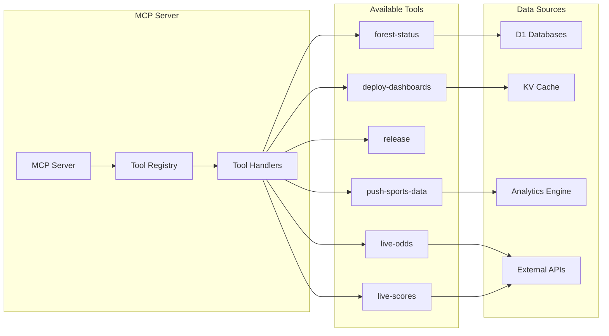

## Queue Processing Flow

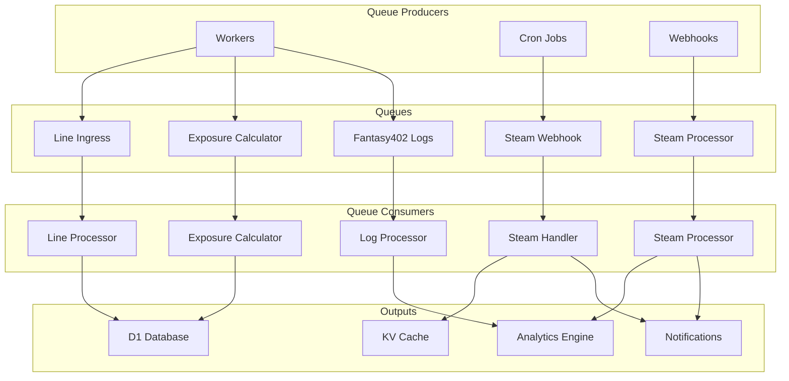

## Security Architecture

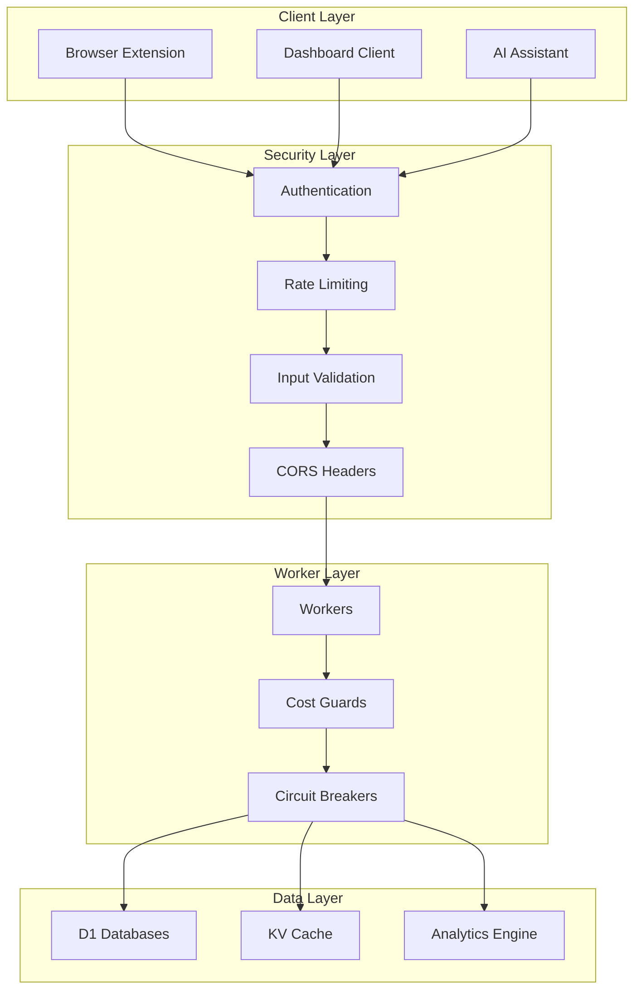

## Monitoring & Observability

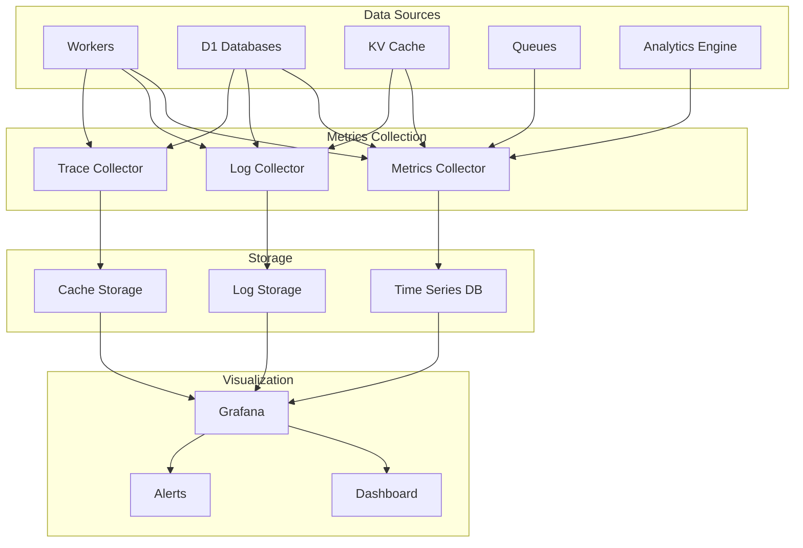

## Deployment Architecture

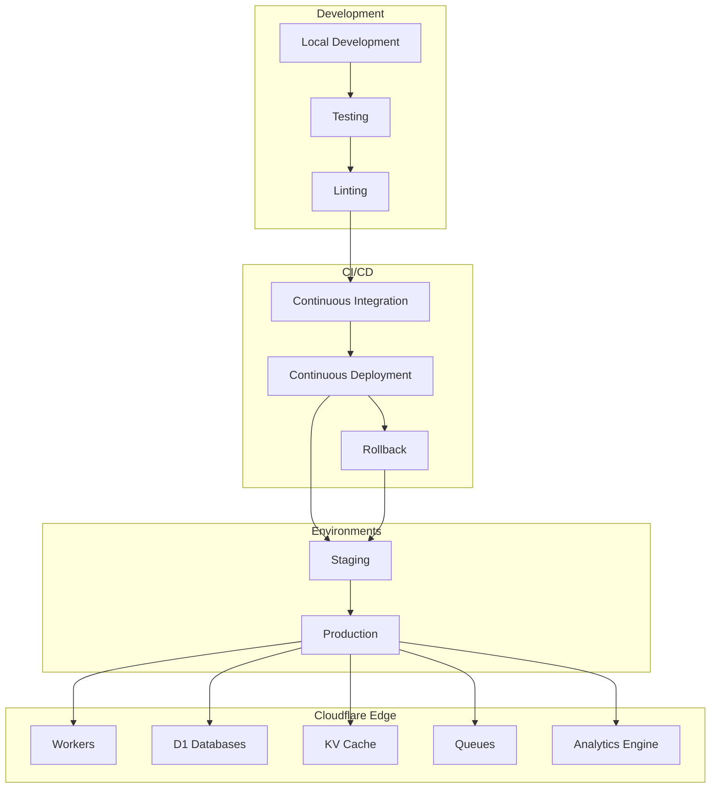

## Fantasy402 Integration Flow

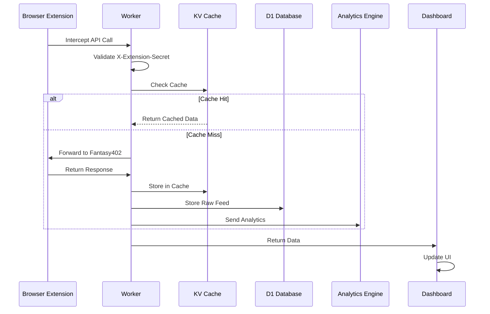

## Agent Graph Population Flow

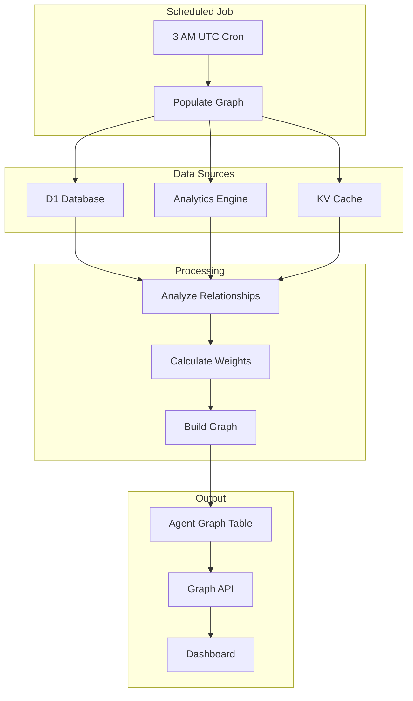

## Cache Warming Flow

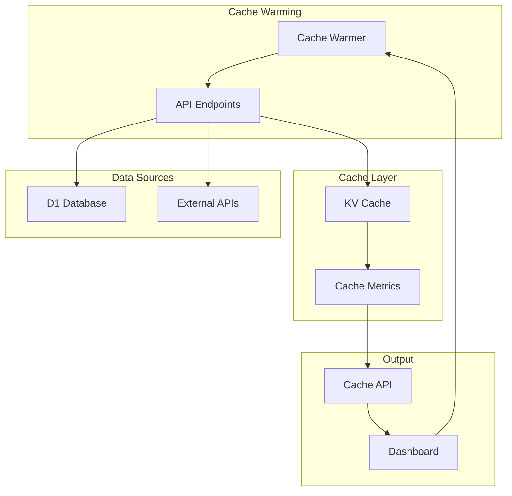

## Error Handling & Circuit Breakers

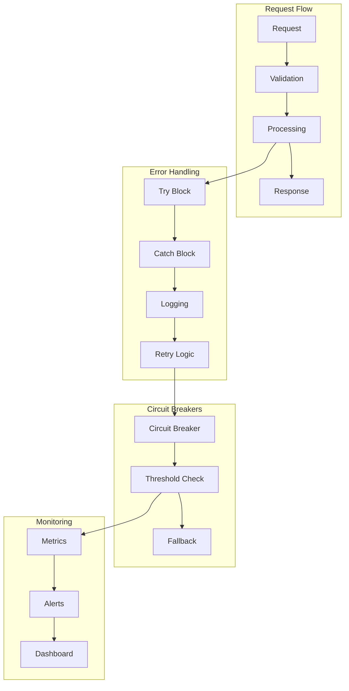

## Performance Monitoring

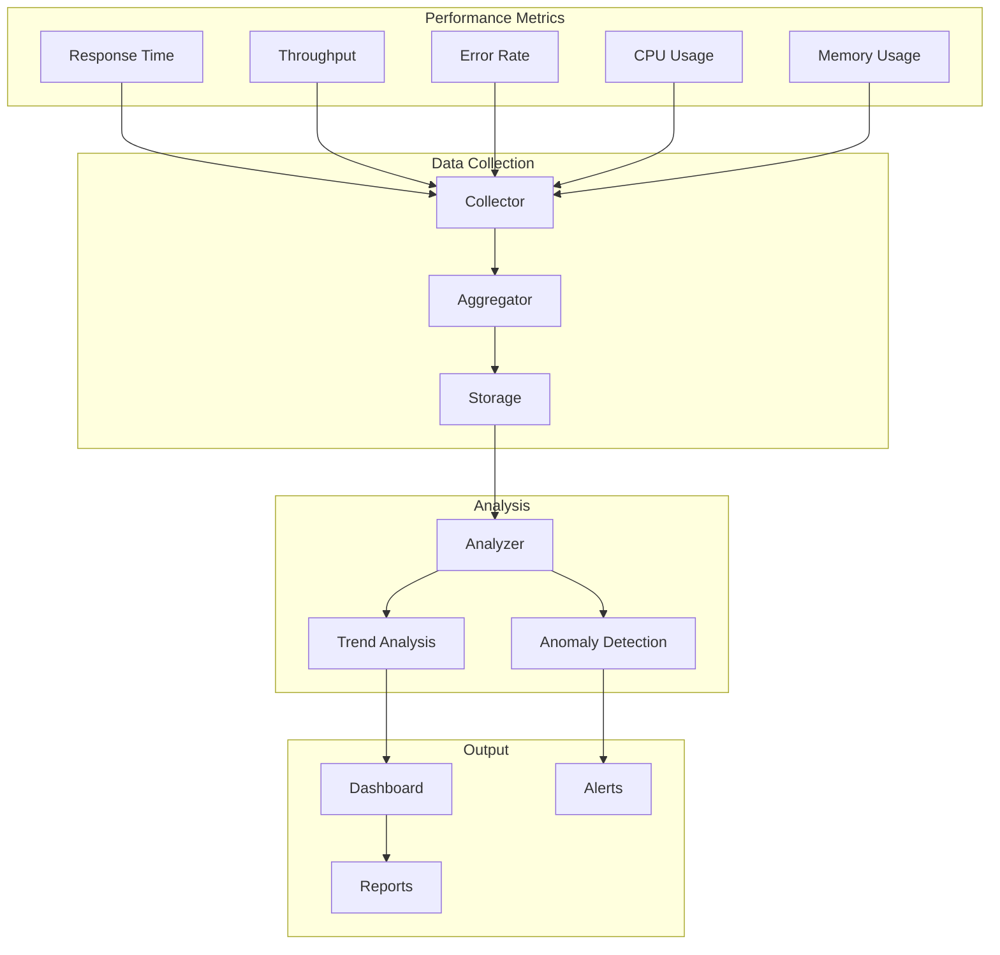

## Data Retention & TTL

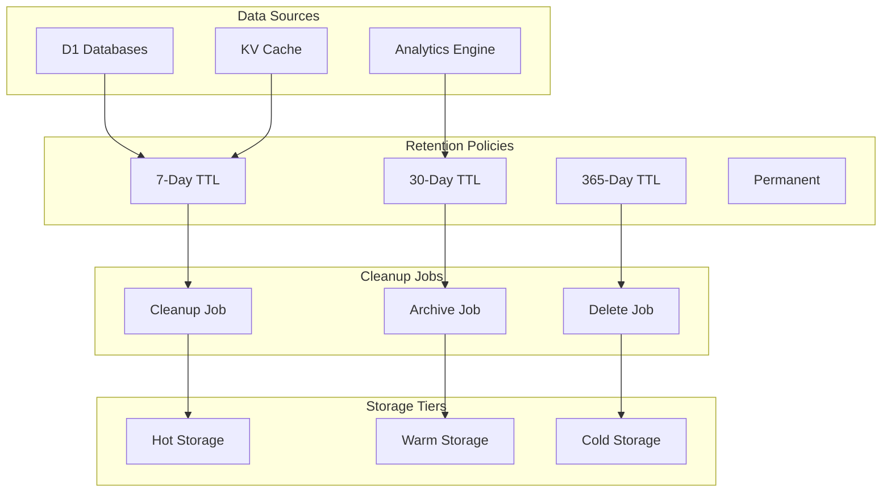

## Backup & Recovery

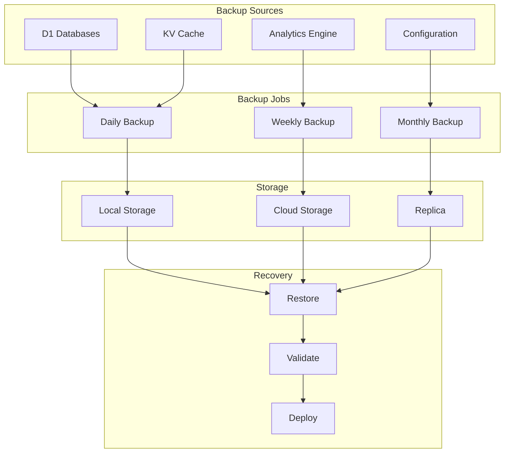

## Compliance & Audit

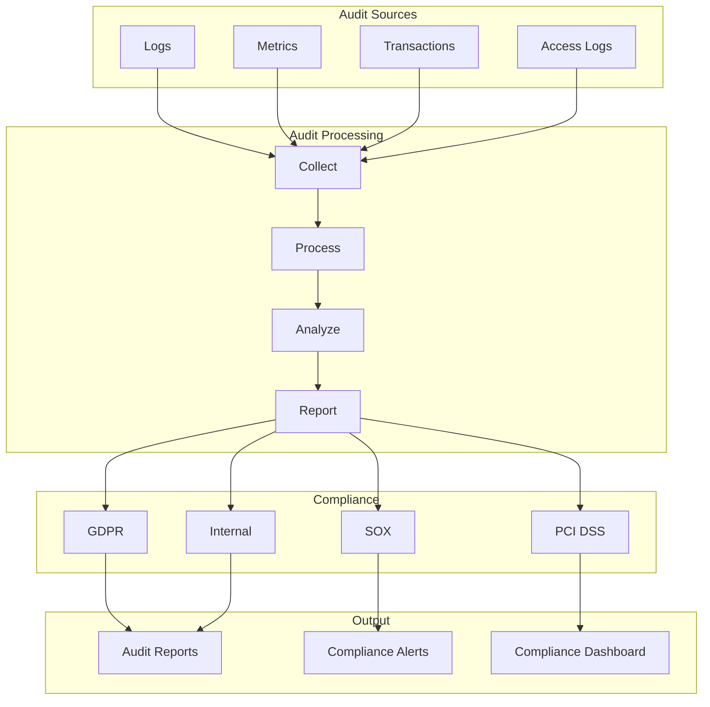

---

**Last Updated:** 2025-10-08  
**Version:** 3.0.0  
**Status:** Production Ready ✅
